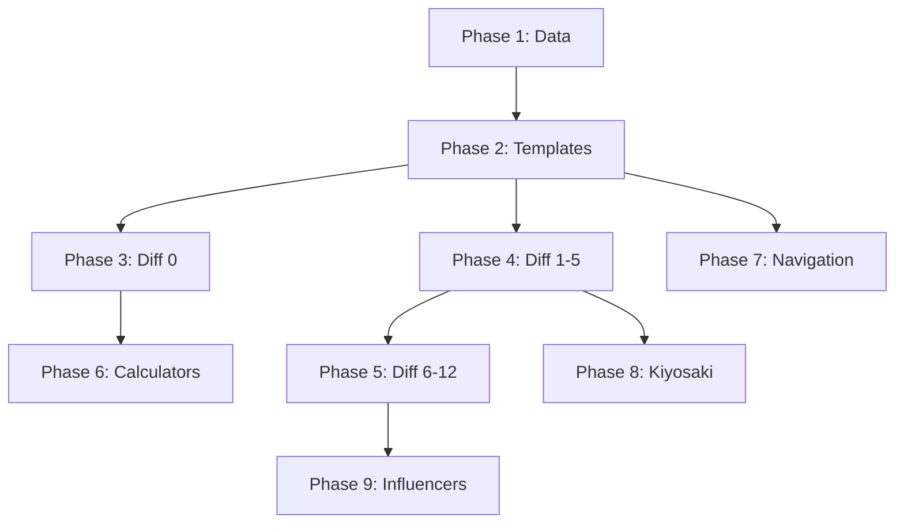

# SEO Expansion Implementation Plan
## Ralph's Method - Complete Phase Breakdown

**Project**: Rich Dad Retirement SEO Expansion
**Scope**: 200+ new keywords, 7 content hubs, 4 calculator tools
**Estimated Traffic Gain**: 55,000+ monthly searches
**Start Date**: January 2026

---

## PHASE 1: INFRASTRUCTURE & DATA LAYER
**Duration**: Foundation
**Goal**: Create data structures and dynamic page templates for new content hubs

### Task P1-001: Create Article Type Definitions
**Status**: ✅ COMPLETE
**File**: `src/types/content-hubs.ts`
**Description**:
- Create TypeScript interfaces for new article types
- Extend existing LearnArticle pattern
- Add hub-specific metadata fields

```typescript
// Types for new content hubs
interface HubArticle {
  slug: string;
  hubSlug: string; // widow-guide, medicaid-planning, etc.
  title: string;
  subtitle: string;
  volume?: number;
  difficulty?: number;
  sections: Section[];
  faqs?: FAQ[];
  relatedArticles?: string[];
  goldBridge?: GoldBridge;
}
```

### Task P1-002: Create Widow's Guide Data Structure
**Status**: ✅ COMPLETE (3 articles created)
**Files**:
- `src/data/widow-guide/index.ts`
- `src/data/widow-guide/articles.ts`
**Keywords Covered**:
| Keyword | Vol | Diff |
|---------|-----|------|
| social security survivor benefits | 7,600 | 46 |
| divorced spouse social security | 300 | 7 |
| first steps after spouse dies | - | - |
| filing taxes widow | - | - |
| health insurance after spouse dies | - | - |
| selling house widow | - | - |

### Task P1-003: Create Medicaid Planning Data Structure
**Status**: ✅ COMPLETE (3 articles created)
**Files**:
- `src/data/medicaid-planning/index.ts`
- `src/data/medicaid-planning/articles.ts`
**Keywords Covered**:
| Keyword | Vol | Diff |
|---------|-----|------|
| irrevocable trust nursing home | 100 | 0 |
| medicaid estate recovery | 1,200 | 27 |
| medicaid penalty period | 150 | 3 |
| lady bird deed medicaid | 40 | 2 |
| life estate medicaid | 60 | 2 |
| can medicaid take house | - | - |
| look back period explained | - | - |

### Task P1-004: Create Grandchildren Legacy Data Structure
**Status**: ✅ COMPLETE (3 articles created)
**Files**:
- `src/data/grandchildren-legacy/index.ts`
- `src/data/grandchildren-legacy/articles.ts`
**Keywords Covered**:
| Keyword | Vol | Diff |
|---------|-----|------|
| 529 plan grandparents | 100 | 0 |
| trust fund for grandchildren | 150 | 1 |
| leaving money to grandchildren | 80 | 0 |
| best way to gift money grandchildren | 50 | 1 |
| teaching money to grandchildren | - | - |

### Task P1-005: Create Senior Protection Data Structure
**Status**: ✅ COMPLETE (2 articles created)
**Files**:
- `src/data/senior-protection/index.ts`
- `src/data/senior-protection/articles.ts`
**Keywords Covered**:
| Keyword | Vol | Diff |
|---------|-----|------|
| grandparent scam calls | - | - |
| medicare scam protection | - | - |
| romance scam warning signs | - | - |
| signs financial exploitation | - | - |
| dementia and giving money away | 100 | 6 |

### Task P1-006: Extend Scenarios Data for Bank Safety
**Status**: ✅ COMPLETE (3 scenarios added)
**Files**:
- `src/data/scenarios/bank-safety.ts` (new)
- `src/data/scenarios/index.ts` (update)
**Keywords Covered**:
| Keyword | Vol | Diff |
|---------|-----|------|
| is vanguard safe | 600 | 5 |
| great depression 2.0 | 150 | 0 |
| can banks freeze your account | 30 | 0 |
| are regional banks safe | - | - |
| prepare for dollar collapse | 40 | 1 |

### Task P1-007: Extend Learn Data for Wealthy Secrets
**Status**: PENDING
**Files**:
- `src/data/learn-articles/wealthy-secrets-cluster.ts`
- `src/data/learn-articles/index.ts` (update)
**Keywords Covered**:
| Keyword | Vol | Diff |
|---------|-----|------|
| what do rich people invest in | 80 | 0 |
| be your own bank | 500 | 3 |
| family office investment strategy | 200 | 4 |
| generational wealth guide | - | - |
| where wealthy keep money | - | - |

### Task P1-008: Extend Rich Dad Strategy Data
**Status**: PENDING
**Files**:
- `src/data/rich-dad/kiyosaki-articles.ts`
- `src/data/rich-dad/index.ts`
**Keywords Covered**:
| Keyword | Vol | Diff |
|---------|-----|------|
| is robert kiyosaki a scam | 10 | 0 |
| robert kiyosaki silver prediction | 90 | 5 |
| rich dad poor dad investment strategy | 20 | 3 |
| robert kiyosaki 2026 prediction | 10 | - |
| kiyosaki vs dave ramsey | - | - |
| savers are losers meaning | 10 | - |

---

## PHASE 2: DYNAMIC PAGE TEMPLATES
**Duration**: After P1 complete
**Goal**: Create reusable page templates for each content hub

### Task P2-001: Widow's Guide Hub Page
**Status**: ✅ COMPLETE
**File**: `src/app/widow-guide/page.tsx`
**Description**:
- Hub landing page listing all widow articles
- Emotional, supportive tone
- Clear navigation by topic
- Augusta CTA integration

### Task P2-002: Widow's Guide Dynamic Article Page
**Status**: ✅ COMPLETE
**File**: `src/app/widow-guide/[slug]/page.tsx`
**Description**:
- Dynamic article renderer for widow content
- generateStaticParams() for all widow articles
- Table of contents with scroll spy
- JSON-LD schema (Article + FAQPage)

### Task P2-003: Medicaid Planning Hub Page
**Status**: ✅ COMPLETE
**File**: `src/app/medicaid-planning/page.tsx`

### Task P2-004: Medicaid Planning Dynamic Article Page
**Status**: ✅ COMPLETE
**File**: `src/app/medicaid-planning/[slug]/page.tsx`

### Task P2-005: Grandchildren Legacy Hub Page
**Status**: ✅ COMPLETE
**File**: `src/app/grandchildren/page.tsx`

### Task P2-006: Grandchildren Legacy Dynamic Article Page
**Status**: ✅ COMPLETE
**File**: `src/app/grandchildren/[slug]/page.tsx`

### Task P2-007: Senior Protection Hub Page
**Status**: ✅ COMPLETE
**File**: `src/app/senior-protection/page.tsx`

### Task P2-008: Senior Protection Dynamic Article Page
**Status**: ✅ COMPLETE
**File**: `src/app/senior-protection/[slug]/page.tsx`

---

## PHASE 3: ZERO COMPETITION ARTICLES (Diff 0)
**Duration**: After P2 complete
**Goal**: 11 articles with ZERO keyword difficulty - guaranteed quick wins

### Task P3-001: "Per Stirpes vs Per Capita" Article
**Status**: ✅ COMPLETE
**Hub**: Estate Planning / Learn
**Keyword**: per stirpes vs per capita | Vol: 3,900 | Diff: 0
**File**: `src/data/learn-articles/estate-cluster.ts`
**Content Outline**:
- Definition of per stirpes distribution
- Definition of per capita distribution
- Real-world examples with family trees
- Pros/cons of each approach
- How to choose for your will/trust
- Gold IRA considerations for inheritance

### Task P3-002: "Cremation vs Burial Cost" Article
**Status**: ✅ COMPLETE
**Hub**: Senior Protection / End of Life
**Keyword**: cremation vs burial cost | Vol: 600 | Diff: 0
**Content Outline**:
- Average cremation costs by state
- Average burial costs by state
- Hidden costs comparison
- Pre-planning options
- Life insurance considerations
- Protecting assets for heirs

### Task P3-003: "Great Depression 2.0" Scenario Page
**Status**: ✅ COMPLETE (P1-006)
**Hub**: Scenarios
**Keyword**: great depression 2.0 | Vol: 150 | Diff: 0
**File**: `src/data/scenarios/great-depression-2.ts`
**Content Outline**:
- Historical parallels to 1929
- Economic indicators today
- What happened to gold in 1930s
- How to protect wealth if it happens
- Scenario simulation (like existing crash simulator)
- Gold IRA as hedge

### Task P3-004: "529 Plan Grandparents" Article
**Status**: ✅ COMPLETE (P1-004)
**Hub**: Grandchildren Legacy
**Keyword**: 529 plan grandparents | Vol: 100 | Diff: 0
**Content Outline**:
- How grandparents can open 529
- Tax benefits for grandparents
- Impact on financial aid
- Superfunding strategy
- State-specific considerations
- Alternative: Gold IRA for education funding

### Task P3-005: "Irrevocable Trust Nursing Home" Article
**Status**: ✅ COMPLETE (P1-003)
**Hub**: Medicaid Planning
**Keyword**: irrevocable trust nursing home | Vol: 100 | Diff: 0
**Content Outline**:
- What is an irrevocable trust
- 5-year lookback period
- Asset protection mechanics
- Medicaid eligibility rules
- Trustee responsibilities
- Gold/precious metals in trusts

### Task P3-006: "Reverse Mortgage Good Idea" Article
**Status**: ✅ COMPLETE
**Hub**: Learn / Retirement
**Keyword**: reverse mortgage good idea | Vol: 100 | Diff: 0
**Content Outline**:
- How reverse mortgages work
- Pros and cons analysis
- Hidden costs and fees
- Alternatives to reverse mortgage
- When it makes sense
- Gold IRA vs home equity

### Task P3-007: "What Do Rich People Invest In" Article
**Status**: ✅ COMPLETE
**Hub**: Learn / Wealthy Secrets
**Keyword**: what do rich people invest in | Vol: 80 | Diff: 0
**Content Outline**:
- Asset allocation of wealthy families
- Alternative investments (gold, real estate, PE)
- Family office strategies
- Tax advantages of wealthy
- How average investors can replicate
- Self-directed IRA as gateway

### Task P3-008: "Leaving Money to Grandchildren" Article
**Status**: ✅ COMPLETE (P1-004)
**Hub**: Grandchildren Legacy
**Keyword**: leaving money to grandchildren | Vol: 80 | Diff: 0
**Content Outline**:
- Skip-a-generation giving strategies
- Trust options for minors
- Tax implications
- Age restrictions and considerations
- Teaching financial responsibility
- Gold as generational wealth transfer

### Task P3-009: "Dividend Stocks for Retirement" Article
**Status**: ✅ COMPLETE
**Hub**: Learn / Retirement
**Keyword**: dividend stocks for retirement | Vol: 50 | Diff: 0
**Content Outline**:
- Dividend investing basics
- Building a dividend portfolio
- Dividend aristocrats list
- Tax implications in retirement
- Risks of dividend investing
- Gold vs dividends comparison

### Task P3-010: "Can Banks Freeze Your Account" Article
**Status**: ✅ COMPLETE (P1-006)
**Hub**: Scenarios / Bank Safety
**Keyword**: can banks freeze your account | Vol: 30 | Diff: 0
**Content Outline**:
- Reasons banks freeze accounts
- Legal protections for depositors
- How to unfreeze accounts
- Cyprus banking crisis example
- Diversification strategies
- Physical gold as protection

### Task P3-011: "Is Robert Kiyosaki a Scam" Article
**Status**: ✅ COMPLETE
**Hub**: Rich Dad Strategy
**Keyword**: is robert kiyosaki a scam | Vol: 10 | Diff: 0
**Content Outline**:
- Kiyosaki's background and credentials
- Rich Dad Poor Dad legitimacy
- Criticisms and controversies
- Bankrupt companies explained
- His gold/silver recommendations
- Our assessment and endorsement

---

## PHASE 4: SUPER EASY ARTICLES (Diff 1-5)
**Duration**: After P3 complete
**Goal**: 24 articles with minimal competition

### Task P4-001: "Joint and Survivor Annuity" Article
**Status**: ✅ COMPLETE
**Keyword**: joint and survivor annuity | Vol: 1,400 | Diff: 3

### Task P4-002: "Simple Cell Phone for Seniors" Article
**Keyword**: simple cell phone for seniors | Vol: 700 | Diff: 4

### Task P4-003: "Fiduciary vs Financial Advisor" Article
**Status**: ✅ COMPLETE
**Keyword**: fiduciary vs financial advisor | Vol: 700 | Diff: 5

### Task P4-004: "Is Vanguard Safe" Article
**Keyword**: is vanguard safe | Vol: 600 | Diff: 5

### Task P4-005: "Be Your Own Bank" Article
**Status**: ✅ COMPLETE
**Keyword**: be your own bank | Vol: 500 | Diff: 3

### Task P4-006: "End of Life Financial Planning" Article
**Status**: ✅ COMPLETE
**Keyword**: end of life financial planning | Vol: 300 | Diff: 2

### Task P4-007: "Social Security Representative Payee" Article
**Status**: ✅ COMPLETE
**Keyword**: social security representative payee | Vol: 300 | Diff: 2

### Task P4-008: "Family Office Investment Strategy" Article
**Keyword**: family office investment strategy | Vol: 200 | Diff: 4

### Task P4-009: "Medicaid Penalty Period" Article
**Status**: ✅ COMPLETE (P1-003)
**Keyword**: medicaid penalty period | Vol: 150 | Diff: 3

### Task P4-010: "Trust Fund for Grandchildren" Article
**Status**: ✅ COMPLETE
**Keyword**: trust fund for grandchildren | Vol: 150 | Diff: 1

### Task P4-011: "Health Insurance Early Retirement" Article
**Status**: ✅ COMPLETE
**Keyword**: health insurance early retirement | Vol: 150 | Diff: 5

### Task P4-012: "Can I Retire at 60 with 500k" Calculator Page
**Keyword**: can i retire at 60 with 500k | Vol: 100 | Diff: 2

### Task P4-013: "Robert Kiyosaki Silver Prediction" Article
**Keyword**: robert kiyosaki silver prediction | Vol: 90 | Diff: 5

### Task P4-014: "Getting Affairs in Order" Checklist
**Status**: ✅ COMPLETE
**Keyword**: getting affairs in order | Vol: 80 | Diff: 1

### Task P4-015: "Mike Maloney Hidden Secrets" Article
**Keyword**: mike maloney hidden secrets | Vol: 70 | Diff: 5

### Task P4-016: "Long Term Care Insurance Worth It" Article
**Status**: ✅ COMPLETE
**Keyword**: long term care insurance worth it | Vol: 70 | Diff: 5

### Task P4-017: "Life Estate Medicaid" Article
**Keyword**: life estate medicaid | Vol: 60 | Diff: 2

### Task P4-018: "Recording Family History" Guide
**Status**: ✅ COMPLETE
**Keyword**: recording family history | Vol: 60 | Diff: 1

### Task P4-019: "Reverse Mortgage Dangers" Article
**Status**: ✅ COMPLETE
**Keyword**: reverse mortgage dangers | Vol: 50 | Diff: 3

### Task P4-020: "Best Way to Gift Money Grandchildren" Article
**Keyword**: best way to gift money grandchildren | Vol: 50 | Diff: 1

### Task P4-021: "Guaranteed Income for Retirement" Article
**Status**: ✅ COMPLETE
**Keyword**: guaranteed income for retirement | Vol: 40 | Diff: 5

### Task P4-022: "How to Prepare for Dollar Collapse" Article
**Keyword**: how to prepare dollar collapse | Vol: 40 | Diff: 1

### Task P4-023: "Elder Law Asset Protection" Article
**Status**: ✅ COMPLETE
**Keyword**: elder law asset protection | Vol: 40 | Diff: 1

### Task P4-024: "Lady Bird Deed Medicaid" Article
**Keyword**: lady bird deed medicaid | Vol: 40 | Diff: 2

---

## PHASE 5: EASY WIN ARTICLES (Diff 6-12)
**Duration**: After P4 complete
**Goal**: 15 articles with easy competition

### Task P5-001: "Contingent Beneficiary Meaning" Article
**Keyword**: contingent beneficiary meaning | Vol: 5,100 | Diff: 6

### Task P5-002: "Conservatorship vs Guardianship" Article
**Keyword**: conservatorship vs guardianship | Vol: 3,900 | Diff: 8

### Task P5-003: "Medigap vs Medicare Advantage" Article
**Keyword**: medigap vs medicare advantage | Vol: 3,800 | Diff: 9

### Task P5-004: "Life Alert Cost Per Month" Review
**Keyword**: life alert cost per month | Vol: 2,600 | Diff: 10

### Task P5-005: "Independent Living vs Assisted" Article
**Keyword**: independent living vs assisted | Vol: 1,000 | Diff: 11

### Task P5-006: "Ray Dalio All Weather Portfolio" Article
**Keyword**: ray dalio all weather portfolio | Vol: 900 | Diff: 12

### Task P5-007: "Community Spouse Resource Allowance" Article
**Keyword**: community spouse resource allowance | Vol: 350 | Diff: 9

### Task P5-008: "Divorced Spouse Social Security" Article
**Keyword**: divorced spouse social security | Vol: 300 | Diff: 7

### Task P5-009: "How Long Will 500k Last Retirement" Calculator
**Keyword**: how long will 500k last retirement | Vol: 300 | Diff: 8

### Task P5-010: "Stairlift Costs" Review
**Keyword**: stairlift costs | Vol: 200 | Diff: 8

### Task P5-011: "Downsizing in Retirement" Article
**Keyword**: downsizing in retirement | Vol: 200 | Diff: 10

### Task P5-012: "Nursing Home vs Home Care" Article
**Keyword**: nursing home vs home care | Vol: 150 | Diff: 6

### Task P5-013: "24 Hour Home Care Cost" Article
**Keyword**: 24 hour home care cost | Vol: 150 | Diff: 7

### Task P5-014: "Retirement Mistakes to Avoid" Article
**Keyword**: retirement mistakes to avoid | Vol: 150 | Diff: 8

### Task P5-015: "Dementia and Giving Money Away" Article
**Keyword**: dementia and giving money away | Vol: 100 | Diff: 6

---

## PHASE 6: CALCULATOR TOOLS
**Duration**: After P5 or parallel
**Goal**: Build 4 interactive calculators

### Task P6-001: Money Longevity Calculator
**Status**: PENDING
**File**: `src/app/tools/money-longevity-calculator/page.tsx`
**Keywords Covered**:
- how long will 500k last in retirement (300, diff 8)
- how long will 1 million last in retirement
- can i retire at 55/60/62 with X
**Features**:
- Starting balance input
- Monthly withdrawal input
- Inflation adjustment
- Investment return scenarios
- Visual timeline graph
- Gold allocation comparison

### Task P6-002: Can I Retire Calculator
**Status**: PENDING
**File**: `src/app/tools/can-i-retire-calculator/page.tsx`
**Keywords Covered**:
- can i retire at 60 with 500k (100, diff 2)
- can i retire at 55 with 1 million
- am i ready to retire
**Features**:
- Current age and target retirement age
- Current savings and monthly contributions
- Expected expenses in retirement
- Social security estimates
- Success probability score

### Task P6-003: Social Security Optimizer
**Status**: PENDING
**File**: `src/app/tools/social-security-optimizer/page.tsx`
**Keywords Covered**:
- when to take social security
- social security 62 vs 67 vs 70
- social security break even calculator
**Features**:
- Birth year input
- Estimated benefit at 62
- Break-even analysis
- Spousal benefit integration
- Survivor benefit planning

### Task P6-004: Medicaid Spend-Down Calculator
**Status**: PENDING
**File**: `src/app/tools/medicaid-spend-down-calculator/page.tsx`
**Keywords Covered**:
- medicaid spend down rules
- medicaid asset limits
- countable vs non-countable assets
**Features**:
- Current asset inventory
- State-specific rules
- Exempt asset identification
- Spend-down strategies
- Timeline to eligibility

---

## PHASE 7: SITEMAP & NAVIGATION
**Duration**: Ongoing with each phase
**Goal**: Keep sitemap updated and improve navigation

### Task P7-001: Update Sitemap for New Hubs
**Status**: ✅ COMPLETE
**File**: `src/app/sitemap.ts`
**Description**:
- Add widow-guide pages
- Add medicaid-planning pages
- Add grandchildren pages
- Add senior-protection pages
- Add new calculator tools

### Task P7-002: Update Footer Navigation
**Status**: PENDING
**File**: `src/components/layout/Footer.tsx`
**Description**:
- Add new content hub links
- Organize by topic clusters

### Task P7-003: Create Content Hub Navigation Component
**Status**: PENDING
**File**: `src/components/layout/HubNavigation.tsx`
**Description**:
- Sidebar navigation for content hubs
- Related articles widget
- Progress tracker for multi-part guides

---

## PHASE 8: KIYOSAKI EXPANSION
**Duration**: After Phase 4
**Goal**: Expand Robert Kiyosaki content hub

### Task P8-001: "Kiyosaki 2026 Predictions" Article
**Keyword**: robert kiyosaki 2026 prediction

### Task P8-002: "Kiyosaki vs Dave Ramsey" Comparison
**Keyword**: kiyosaki vs dave ramsey

### Task P8-003: "Kiyosaki vs Suze Orman" Comparison
**Keyword**: kiyosaki vs suze orman

### Task P8-004: "Savers Are Losers Explained" Article
**Keyword**: savers are losers meaning

### Task P8-005: "Rich Dad Investment Strategy" Article
**Keyword**: rich dad poor dad investment strategy

---

## PHASE 9: INFLUENCER CONTENT
**Duration**: After Phase 5
**Goal**: Create influencer-focused content

### Task P9-001: "Ray Dalio All Weather Portfolio" Deep Dive
**Keyword**: ray dalio all weather portfolio | Vol: 900

### Task P9-002: "Peter Schiff Was Right" Article
**Keyword**: peter schiff was right

### Task P9-003: "Mike Maloney Hidden Secrets of Money" Article
**Keyword**: hidden secrets of money

### Task P9-004: "Jim Rickards Dollar Collapse" Article
**Keyword**: jim rickards dollar collapse

### Task P9-005: "Lynette Zang Gold Predictions" Article
**Keyword**: lynette zang gold predictions

---

## PHASE 10: TESTING & LAUNCH
**Duration**: End of each phase
**Goal**: Ensure quality and functionality

### Task P10-001: Build Verification
- Run `npm run build` after each phase
- Verify all pages generate correctly
- Check for TypeScript errors

### Task P10-002: Visual QA
- Test all pages on mobile
- Verify dark theme consistency
- Check CTA visibility

### Task P10-003: SEO Verification
- Verify meta tags
- Check JSON-LD schemas
- Submit new pages to Google Search Console

---

## IMPLEMENTATION PRIORITY ORDER

### Week 1-2: Foundation (P1 + P2)
1. P1-001 → P1-008 (Data structures)
2. P2-001 → P2-008 (Page templates)

### Week 3: Zero Competition (P3)
3. P3-001 → P3-011 (11 articles, diff 0)
   - Estimated traffic: 5,000+/month

### Week 4-5: Super Easy (P4)
4. P4-001 → P4-024 (24 articles, diff 1-5)
   - Estimated traffic: 8,000+/month

### Week 6-7: Easy Wins (P5)
5. P5-001 → P5-015 (15 articles, diff 6-12)
   - Estimated traffic: 15,000+/month

### Week 8-9: Calculators (P6)
6. P6-001 → P6-004 (4 calculators)
   - Estimated traffic: 10,000+/month

### Week 10: Kiyosaki + Influencers (P8 + P9)
7. P8-001 → P8-005 (Kiyosaki)
8. P9-001 → P9-005 (Influencers)
   - Estimated traffic: 3,500+/month

### Ongoing: Navigation & QA (P7 + P10)
9. Update sitemap after each phase
10. Visual QA and SEO verification

---

## SUCCESS METRICS

| Metric | Target | Measurement |
|--------|--------|-------------|
| New Pages Created | 75+ | Count |
| Monthly Organic Traffic | +55,000 | Google Analytics |
| Ranking Keywords | 200+ | SEMrush/Ahrefs |
| Page 1 Rankings | 50+ | Search Console |
| Lead Conversions | +25% | Quiz completions |

---

## DEPENDENCIES



---

## NOTES

- All articles follow existing LearnArticle pattern
- Augusta CTA on every article
- Dark theme (slate-900) throughout
- JSON-LD schema for all articles
- Mobile-first responsive design
- Gold bridge section connects to quiz/Augusta

---

*Generated by Ralph's Method SEO Expansion Planner*
*Last Updated: January 2026*
